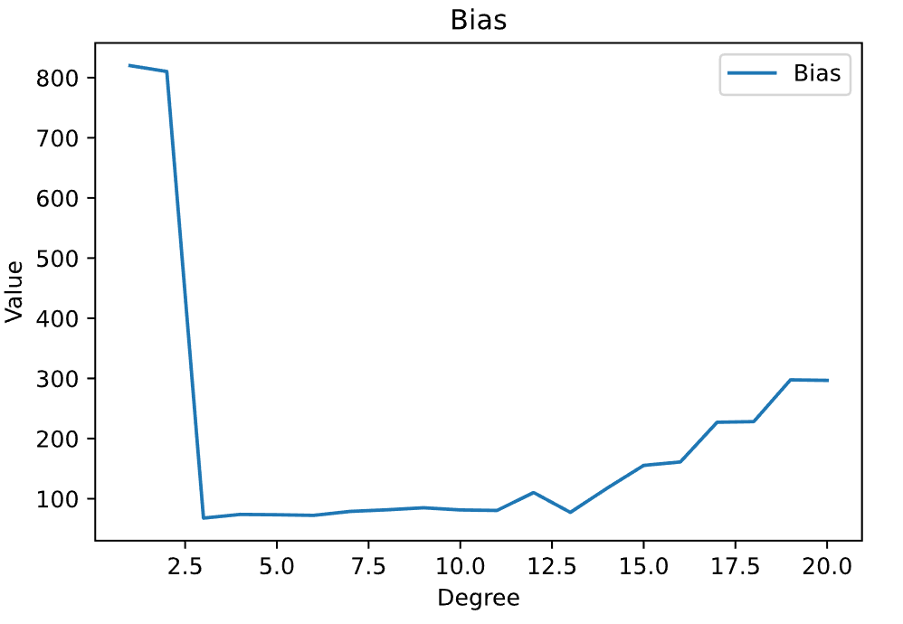

# MDL Assignment 1 Report
## Team 48:
### Abhijeeth Singam, Saravanan Senthil

---

## **Task 1:** 
### LinearRegression().fit()
Given test data, LinearRegression().fit() minimises the square difference between the model and the data to find the weights and bias of a regression that yield the most accurate results. In the case of a simple regression, this happens to be the 'line of best fit'. It uses gradient descent.


To calculate the aforementioned 'accuracy' of a set of weights and bias, the MSE (Mean Squared Error) is used. LinearRegression().fit() aims to reduce this MSE as much as possible to result in the most accurate set of weights and bias that it can achieve.

---

## **Task 2:**

### Bias
Bias is one of two ways of measuring the accuracy of an ML model. It represents the difference between the 'expected value' or 'average value' of the model and the actual value we are trying to predict.

Bias is calculated by taking the square root of Bias^2^ using the formula:  


Code:

```python
bias2 = np.mean( (np.mean(predMatrix, axis = 0) - testData[:, 1] ) ** 2 )
bias = np.mean( abs(np.mean(predMatrix, axis = 0) - testData[:, 1] ))
```
where predMatrix is the collection of y_predict from the trained models for each degree



### Variance

Variance is the other way in which the accuracy of an ML model is measured. It represent the 'variability' of the model's prediction, i.e. how much the predicted values vary for different realisations of that model.

Variance is calculated using the formula: 

  

Code:  
```python
variance = np.mean(np.var(predMatrix, axis = 0))
```
where predMatrix is the collection of y_predict from the trained models for each degree
Where np.var is numpy's builtin to function compute variance


---

## **Task 3:**
### Calculating Irreducible Error

Irreducible error is a measure of the 'noise' in the supplied data. It is referred to as 'irreducible' as this error arises from the data and not the model and thus cannot be reduced no matter how good the created model is.

To calculate irreducible error, we used the formula:  


### Plotting irreducible error


---

## **Task 4:**
### Plotting Bias^2^ - Variance graph


### Understanding the graph:

In this graph we display three different values: Bias^2^, Variance and Total Error. Total error, as the name suggests, represents the total of Bias^2^, Variance, and Irreducible error. This is what we aim to minimise when optimising our model. We observe that as the 'degree' or the complexity of our model increases, the variance increases and the bias^2^ decreases (in an ideal situation it would continuously decrease but here we observe an increase towards the end).  

At lower degrees, the model fails to accurately represent the training data and the test data. This is due to the lower number of features not being able to fully represent the data being provided. Due to this we observe a high bias. The low observed variance is due to the model being consistent but inaccurate which leads to a lower variance but a higher bias.

At higher degrees the model 'overfits', i.e. the model represents the training data very accurately but with the loss of generality. This results in the model performing poorly on test data or any data other than the data it was trained with. This leads to a very low bias as it very closely represents the training data but an high variance as it fails to remain consistent due to the differences between different training sets. 

### Understanding the type of data:

The bias is high for models that represent polynomials of lower degrees as it underfits the data (is not complex enough to represent the data).

The variance is higher for more complex models as they overfit. **Variance** tells you the degree of spread in your data set, and as overfitting occurs, it leads to the predictions of the models to be increasingly chaotic and spread out.

### Tabulating the results:

|   degree |     bias |   variance |
|---------:|---------:|-----------:|
|        1 | 820.007  |    38675.6 |
|        2 | 810.233  |    55083.9 |
|        3 |  67.7832 |    58210.8 |
|        4 |  73.8759 |    71113.8 |
|        5 |  73.316  |    91106.6 |
|        6 |  72.2846 |   108828   |
|        7 |  78.8863 |   116725   |
|        8 |  81.5498 |   144484   |
|        9 |  84.9207 |   158619   |
|       10 |  81.3285 |   159168   |
|       11 |  80.4445 |   170230   |
|       12 | 110.248  |   173786   |
|       13 |  77.2448 |   166664   |
|       14 | 117.41   |   163289   |
|       15 | 155.396  |   169819   |
|       16 | 161.111  |   182661   |
|       17 | 227.113  |   186223   |
|       18 | 228.15   |   197952   |
|       19 | 297.603  |   198454   |
|       20 | 296.723  |   208133   |